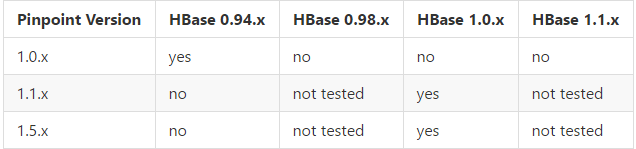
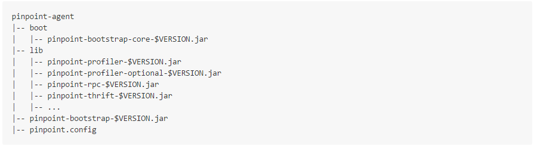

pinpoint安装文档翻译,[原文地址](https://github.com/naver/pinpoint/blob/master/doc/installation.md#pinpoint-collector)
------
##安装
想要建立一个自己的pinpoint实例,你需要运行以下组件:
- HBase(存储)
- Pinpoint Collector(部署在web容器上)
- Pinpoint Web(部署在Web容器上)
- Pinpoint Agent(连接到一个java应用,用来分析应用)
如果你想只是想运行一个简单的实例,请查看[快速入门](https://muf.gitbooks.io/pinpoint-leaning/content/quickStart/)

##概述
1. HBase
	- 建立一个HBase集群 [Apache HBase](http://hbase.apache.org/)
	- 建立一个HBase Schemas,类似:feed/scripts/hbase-create.hbase的shell脚本

1. 建立Pinpoint
	- 克隆Pinpoint(git clone $PINPOINT_GIT_REPOSITORY)
	- 设置环境变量JAVA_6_HOME指向JDK6的主目录
	- 设置环境变量JAVA_7_HOME指向JDK6的主目录
	- 在Pinpoint主目录执行以下命令:
	```java
    mvn install -Dmaven.test.skip=true
    ```


1. Pinpoint Collector
	- 将pinpoint-collector-$VERSION.war部署到一个web容器
	- 配置pinpoint-collector.properties, hbase.properties.
	- 启动容器


1. Pinpoint Web
	-  将pinpoint-web-$VERSION.war部署到一个web容器的ROOT应用
	-  配置pinpoint-web.properties, hbase.properties.
	-  启动容器


1. Pinpoint Agent
	- 拉取或者移动pinpoint-agent/到合适的位置（$AGENT_PATH）
	- 将-javaagent:$AGENT_PATH/pinpoint-bootstrap-$VERSION.jar附加到JAVA应用的JVM参数中
	- 设置-Dpinpoint.agentId和-Dpinpoint.applicationName命令行参数
	- 启动JAVA应用

####HBase
Pinpoint使用HBase作为Collector和Web的后台存储
你可以查看[HBase官网]来安装你的HBase集群,HBase的兼容性如下表:

一旦你的HBase运行起来,请确保你的Collector和Web的配置正确,能够连接到HBase

####创建Schemas
Pinpoint有2个脚本用于创建表:hbase-create.hbase和hbase-create-snappy.hbase，hbase-create-snappy.hbase用于snappy压缩(需要用到[snappy](http://code.google.com/p/snappy))否则使用hbase-create.hbase安装
用HBase脚本运行这些脚本,像这样:
```java
$HBASE_HOME/bin/hbase shell hbase-create.hbase
```
在[这里](https://github.com/naver/pinpoint/tree/master/hbase/scripts)看到一个完整的脚本列表。

####搭建Pinpoint
这里有两种选择

	1. 下载[最新release](https://github.com/naver/pinpoint/releases/latest)版本并且跳过构建,推荐
	2.  从git上clone下来手动建立Pinpoint(这一部分就不翻译了,如果有兴趣可以查看原文)

####Pinpoint Collector
你需要准备以下war包用来部署到web容器:
pinpoint-collector-$VERSION.war

######安装
由于Pinpoint Collector是一个封装起来的可扩展war包文件,你需要将他部署到一个没有其他任何web应用的web容器中

######配置
Pinpoint Collector有两个配置文件需要配置：pinpoint-collector.properties, and hbase.properties.
1. pinpoint-collector.properties collerctor包含的配置,

这些文件都位于war包的WEB-INF/classes/目录下
你可以查看默认的配置文件:[pinpoint-collector.properties](https://github.com/naver/pinpoint/blob/master/collector/src/main/resources/pinpoint-collector.properties),[hbase.properties](https://github.com/naver/pinpoint/blob/master/collector/src/main/resources/hbase.properties)

####Pinpoint Web
你需要准备以下war包用来部署到web容器:
pinpoint-web-$VERSION.war

######安装
由于Pinpoint Collector是一个封装起来的可扩展war包文件,你需要将他部署到一个没有其他任何web应用的web容器中,该Web模块还必须部署为ROOT应用。

######配置
类似colletory一样,Pinpoint Web也有两个配置文件需要配置:pinpoint-web.properties和hbase.properties.
请确保你检查了一下配置选线
1. pinpoint-collector.properties - contains configurations for the collector. Check the following values with the agent's configuration options :
    - collector.tcpListenPort (agent's profiler.collector.tcp.port - default: 9994)
    - collector.udpStatListenPort (agent's profiler.collector.stat.port - default: 9995)
    - collector.udpSpanListenPort (agent's profiler.collector.span.port - default: 9996)
1. hbase.properties - 该配置用来连接HBase
     - hbase.client.host (default: localhost)
     - hbase.client.port (default: 2181)

这些文件都位于war包的WEB-INF/classes/目录下
你可以查看默认的配置文件:[pinpoint-collector.properties](https://github.com/naver/pinpoint/blob/master/collector/src/main/resources/pinpoint-collector.properties),[hbase.properties](https://github.com/naver/pinpoint/blob/master/collector/src/main/resources/hbase.properties)

####Pinpoint Agent
如果你下载并解压Pinpoint-Agent文件,你应该能得到一个下图类似的目录:


######安装
Pinpoint Agent作为一个java代理运行,连接到一个应用程序(如tomcate)
将$AGENT_PATH/pinpoint-bootstrap-$VERSION.jar添加到运行时的应用的Jvm参数 -javaagent中:
```shell
-javaagent:$AGENT_PATH/pinpoint-bootstrap-$VERSION.jar
```
此外,Pinpoint为了在分布式系统中识别自己还需要设置两个命令行:
- -Dpinpoint.agentId -唯一标识代理正在运行的应用程序实例
- -Dpinpoint.applicationName -组若干相同的应用程序实例作为一个单一的服务
注意，pinpoint.agentid必须确定一个应用实例的全局唯一的，和所有的应用程序共享相同的pinpoint.applicationname被视为一个单一的服务的多个实例。

######tomcate实例
添加-javaagent, -Dpinpoint.agentId, -Dpinpoint.applicationName到tomcate的启动脚本中(catalina.sh)
```shell
CATALINA_OPTS="$CATALINA_OPTS -javaagent:$AGENT_PATH/pinpoint-bootstrap-$VERSION.jar"
CATALINA_OPTS="$CATALINA_OPTS -Dpinpoint.agentId=$AGENT_ID"
CATALINA_OPTS="$CATALINA_OPTS -Dpinpoint.applicationName=$APPLICATION_NAME"
```

######配置
Pinpoint Agent在 $AGENT_PATH/pinpoint.config中各种可用的配置选项

大多数这些选项是不需要处理的,但是一些重要的配置你必须检查比如collector ip address,TCP/UDP端口。这些值是agent用来连接到collector和确保功能的。

在pinpoint.config适当的设置这些配置:
- profiler.collector.ip (默认: 127.0.0.1)
- profiler.collector.tcp.port (collector的collector.tcpListenPort - 默认: 9994)
- profiler.collector.stat.port (collector的collector.udpStatListenPort - 默认: 9995)
- profiler.collector.span.port (collector的collector.udpSpanListenPort - 默认: 9996)

你可以在[这里](https://github.com/naver/pinpoint/blob/master/agent/src/main/resources/pinpoint.config)查看pinpoint.conf可能需要用到的配置选项

####其他
######将Web请求路由到agent
从1.5.0开始,Pinpoint可以通过Collector将web的请求直接发送到agent(反之亦然),为了做到这点，我们使用Zookeeper来建立agent与collector之间,collctor与web之间的通信渠道,有了这个之后,实时通信(如活跃的线程计数监测)有了可能
我们使用典型的Zookeeper提供HBase后台,所以有些额外的Zookeeper配置需要管理员配置
相关的配置选项如下所示:
1. Collector - pinpoint-collector.properties
	- cluster.enable
    - cluster.zookeeper.address
    - cluster.zookeeper.sessiontimeout
    - cluster.listen.ip
    - cluster.listen.port

1. Web - pinpoint-web.properties
	- cluster.enable
	- cluster.web.tcp.port
	- cluster.zookeeper.address
	- cluster.zookeeper.sessiontimeout
	- cluster.zookeeper.retry.interval
	- cluster.connect.address