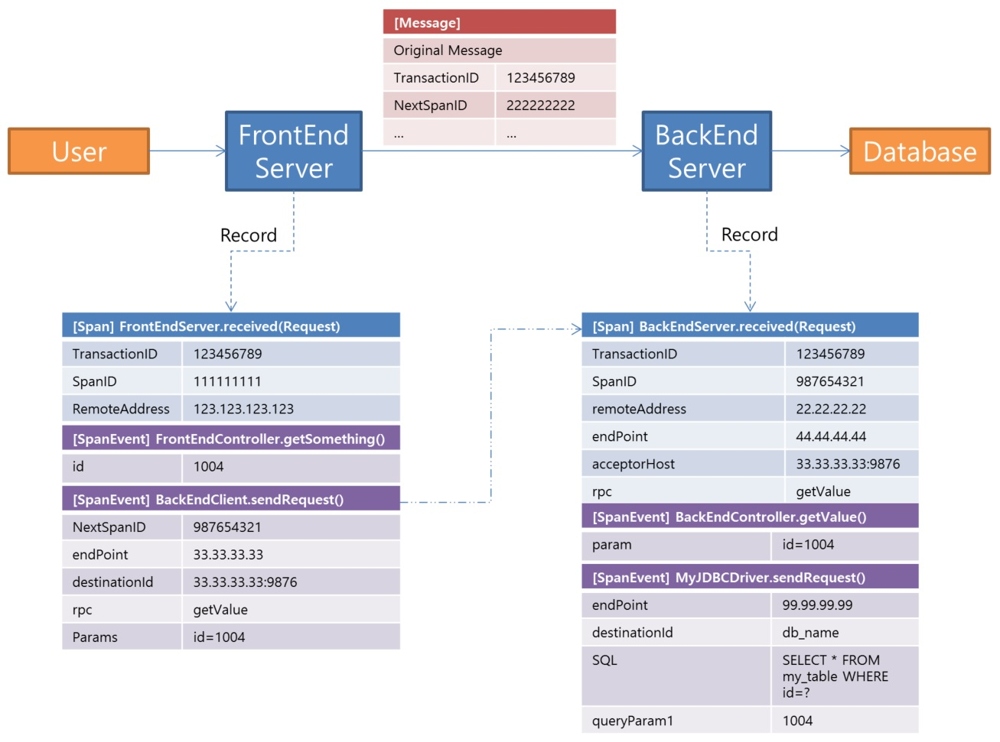

Pinpoint插件开发指南（翻译[原文](https://github.com/naver/pinpoint/wiki/Pinpoint-Plugin-Developer-Guide)）
======

你可以写一个Pinpoint的事件跟踪器来分析目标覆盖范围，在动手之前请查看trace data内容

1. Trace Data
    在Pinpoint中，一个事物是由一组span组成.在事物中，每一个Span表示一个trace的单个逻辑节点
    让我们假设有一个系统如下，FrontEnd服务从user接收请求，并且发送请求到BackEnd服务，然后访问数据库;假设在FrontEnd和BackEnd之间只有Pinpoint agent。
    

    当请求到达FrontEnd服务，Pinpoint agent生产一个新的transaction id并且创建一个span。FrontEnd服务调用BackEnd服务处理请求。此时，Pinpoint agent注入transaction id(加上一些其他的值)到调用信息中.当BackEnd服务接收到信息，会从信息中提取出transaction id并且创建一个新该节点（BackEnd服务）的span。在单个事物中所有的span是共享transaction id的

	span记录重要的调用方法和它们的关系数据（参数，返回值等）,并且将它们的调用栈封装在SpanEvent中。Span和它的每一个SpanEvent表示一个方法调用。

	Span和SpanEvent有用很多属性，但是它们中大多数都是由Pinpoint agent内部处理，开发人员不需要关心它们。接下来我们将解释哪些属性需要由是必须由插件开发人员处理的，

1. Pinpoi插件结构
	Pinpoint插件由==TraceMetadataProvider==和==ProfilerPlugin==的实现组成。==TraceMetadataProvider==的实现为Pinpoint Agent,Web,Collector提供==ServiceType==和==AnnotationKey==。==ProfilerPlugin==实现Pinpoint Agent将目标类到记录跟踪数据的转换
    插件是打包成jar文件的,Pinpoint Agent使用==ServiceLoad==从插件目录查找==TraceMetadataProvider==和==ProfilerPlugin==，而Web和Collector是从WEB/lib目录查找。==ServiceLoader==要求提供位于==META-INF/services==目录的配置文件。所以你必须把以下文件放在插件的jar文件内
    - META-INF/services/com.navercorp.pinpoint.bootstrap.plugin.ProfilerPlugin
    - META-INF/services/com.navercorp.pinpoint.common.trace.TraceMetadataProvider

    [这里](https://github.com/naver/pinpoint-plugin-template) 是一个插件模板,你可以使用此模板创建你自己的插件

	1. TraceMetadataProvider
		TraceMetadataProvider的实现提供==ServiceTypes==和==AnnotationKeys==

        1. ServiceType
    		每个Span和SpanEvent都有一个ServiceType.ServiceType表示跟踪方法属于哪一个库,以及Span和SpanEvent如何处理跟踪的.
            下面这个表显示了ServiceType的属性

            | 属性 | 描述 |
            |--------|--------|
            |   name     |    ServiceType的名称，必须唯一    |
            |   code     |    ServiceType的code，必须唯一    |
            |   desc     |    描述    |
            |   properties     |    属性    |

        	ServiceTpe code的值需要跟相应的类型匹配，下面表格是它的类别对应的code值范围

            | 类别 | 范围 |
            |--------|--------|
            |   Internal Use     |    0 ~ 999    |
            |   Server     |    1000 ~ 1999    |
            |   DB Client     |    2000 ~ 2999    |
            |   Cache Client     |    8000 ~ 8999    |
            |   RPC Client     |    9000 ~ 9999    |
            |   Others     |    5000 ~ 7999    |

            ServiceType的code值必须是唯一的，所以如果你写的插件想要开源共享,那么你需要联系Pinpoint的开发小组,让其分配code.如果你的插件值是自己用，你可以从以下表格中自由选择一个值

            | 类别 | 范围 |
            |--------|--------|
            |   Server     |    1900 ~ 1999    |
            |   DB Client     |    2900 ~ 2999    |
            |   Cache Client     |    8900 ~ 8999    |
            |   RPC Client     |    9900 ~ 9999    |
            |   Others     |    75000 ~ 7999    |

            ServiceType也可以有以下属性

            | 属性 | 描述 |
            |--------|--------|
            |   TERMINAL     |    Span或者SpanEvent调用一个远程节点,但是这个目标节点并不是Pinpoint可追踪的  |
            |  INCLUDE_DESTINATION_ID     |    Span或者SpanEvent记录的目的地ID和远程服务器是不可以追踪的    |
            |   RECORD_STATISTICS     |    Pinpoint Collector应该统计Span或者SpanEvent的实行时间    |

        1. AnnotationKey
        	你可以在Span或者SpanEvent通过注解记录更多的信息,一个注解是一个K-V键值对,其中k是==AnnotationKey==类型,V是基础类型,字符串或者字节数组. 这里是一些预定义的==AnnotationKey==的常用注解类型,如果有需要你也在==TraceMetadataProvider==中定义你自己需要的类型

            | 属性 | 描述 |
            |--------|--------|
            |   name     |    AnnotationKey的名称  |
            |  code     |    AnnotationKey的int类型的code,必须唯一    |
            |   properties     |    属性    |

            如果你的开源插件中需要添加一个新的AnnotationKey,你需要联系Pinpoint的开发小组,让其分配AnnotationKey code.如果你的插件只是自己用,你可以从900到999之间自由选择一个code

            下面这个表格显示的是AnnotationKey的属性

			 | 属性 | 描述 |
            |--------|--------|
            |   VIEW_IN_RECORD_SET     |   在调用树中显示的注解  |
            |  ERROR_API_METADATA     |    这属性表示插件不适用    |

        1. 例子
        	你可以在[这里](https://github.com/naver/pinpoint-plugin-sample/blob/master/plugin/src/main/java/com/navercorp/pinpoint/plugin/sample/SampleTraceMetadataProvider.java)找到==TraceMetadataProvider==的例子
            你也可能通过ServiceType获取AnnotationKeyMatcher
            ```java
            TraceMetadata.addServiceType(ServiceType, AnnotationKeyMatcher)
            ```
            当ServiceType的Span或者SpanEvent显示在事物调用树中，你可以像上面代码一样通过一个AnnotationKeyMatcher匹配到表示在调用树种显示的注解（即：属性是VIEW_IN_RECORD_SET的AnnotationKey）

	1. 探查器插件
		探查器通过修改目标类库收集跟踪数据
        ######探查器的工作流程如以下步骤：
        1. JVM启动时,agent启动
        1. Agent加载当前插件目录下的所有插件
        1. Agent调用每个已经加载的插件的ProfilerPlugin.setup(ProfilerPluginSetupContext)方法
        1. 在Setup方法中，会注册一个回调来转换插件定义的需要转换的类
        1. 目标应用启动
        1. 每当一个类加载时,Agent会查看这个类是否注册了TransformerCallback回调
        1. 如果注册了TransformerCallback,Agent会调用==doInTransform==方法
        1. TransformerCallback会修改目标类的字节码（添加拦截,添加属性等）
        1. 修改后的字节码会返回给JVM,JVM加载这个修改后返回的字节码类
        1. 继续执行应用
        1. 当修改的方法被调用时,在方法的前和后注入拦截器
        1. 拦截器记录跟踪数据

    	重点总结为:
            - 搞清楚哪些方法足够支持跟踪
            - 注入拦截器跟踪这些方法
        这些拦截器用来在跟踪数据被发往Collector前对数据进行解压、存储和分发.拦截器可以互相合作,共享它们的上下文.插件可以通过增加getters来辅助跟踪,甚至添加自定义属性到目标类中,从而使得拦截器在可以在执行过程中访问它们.[Pinpoint插件例子](https://github.com/naver/pinpoint-plugin-sample)告诉你怎样通过TransformerCallback修改类并且注入拦截器到跟踪方法中.

        #####接下来我们讲不同拦截器必须跟踪什么样不同的方法
			1. 普通方法
			普通方法是指在这个节点中不是一个接一个顶级方法,或者不涉及远程，异步调用.[例子2](https://github.com/naver/pinpoint-plugin-sample/tree/master/plugin/src/main/java/com/navercorp/pinpoint/plugin/sample/_02_Injecting_Custom_Interceptor)讲的是如何跟踪一个普通方法.

            1. 节点的顶级方法
			节点的顶级方法是其拦截器在该节点开始一个新的==trace==的方法,这种方法是一个典型的rpc,并且该trace会记录一个==ServiceType==类型是服务的Span.
            Span是否被记录,取决于其事务是否在前一个节点已经开始

                - 新事务
                如果当前节点该事务第一个记录的节点,你必须创建一个新的事务ID（tracId）并且记录它.你只需要调用==TraceContext.newTraceObject()==就可以自动处理（即创建一个新的事务id并且记录）
                - 传递事务
                如果一个请求是来自其他Agent的跟踪节点,这个事务已经存在一个traceId;那么你必须将以下的数据记录到span中(通常情况下这些数据都是封装在==request message==中由一个节点发出)

                | 名字 | 描述 |
                |--------|--------|
                |   transactionId     |    事务id  |
                |  parentSpanId     |    前一个节点的SpanID    |
                |   parentApplicationName     |    前一个应用名    |
                |   parentApplicationType     |    前一个应用类型    |
                |   rpc     |    程序名(可选)    |
                |   endPoint     |    服务端地址（当前节点）    |
                |   remoteAddr     |    客户端地址    |
                |   acceptorHost     |    客户端使用的服务端地址    |

                Pinpoint通过==acceptorHost==来查找两个节点之间的==调用-被调用==关系，通常==acceptorHost==和==endPoint==是相同的.但是，有的时候客户端发送请求的地址和服务端接收到请求的地址不同（比如代理）,这种情况你必须记录客户端发送请求的实际地址来记录==acceptorHost==,一般情况下，客户端插件会将地址与跟其他的事务信息一样添加在==request message==中
                此外,你也必须使用上一个节点发送过来的SpanId.
                有事,前一个节点的事务没有跟踪，此时,你必须不去跟踪这个事务
                如你所见,客户端插件可以将很多数据传递到服务端插件中，如何做到这些取决于他们之间的协议
                你可以在[这里](https://github.com/naver/pinpoint-plugin-sample/tree/master/plugin/src/main/java/com/navercorp/pinpoint/plugin/sample/_14_RPC_Server)找到拦截顶级方法服务的例子

            1. 调用远程节点的方法
            	拦[](http://)截调用远程节点的方法所需要记录的数据如下
                | 名字 | 描述 |
                |--------|--------|
                |   endPoint     |    目标服务器地址  |
                |  destinationId     |    目标节点的逻辑名    |
                |   rpc     |    调用目标的程序名（可选）   |
                |   nextSpanId     |    下一个节点将会使用的SpanId（如果下一个节点是可以通过Pinpoint跟踪的）    |

                下一个节点是否可以==traceable==，将会影响拦截器的实现.==traceable==在这里是指的可行性,例如.一个Http客户端的下一个节点是Http服务端,Pinpoint不跟着所有的Http服务,但是如果它已经有了Http服务插件，那么它就可以==traceable==的。另外MySql JDBC的下一个节点是Mysql服务器的话就是不==traceable==的

                - 如果下一个节点是==traceable==
                如果下一个节点是==traceable==的,那么拦截器必须传递以下数据到下一个节点.怎样传递是跟他们之间的通信协议相关的，在最差的情况下可能无法传递它们
				| 名字 | 描述 |
                |--------|--------|
                |   transactionId     |    事务id  |
                |  parentApplicationName     |    当前节点的应用名    |
                |   parentApplicationType     |    当前节点的应用类型   |
                |   parentSpanId     |    当前节点的SpanId    |
                |   nextSpanId     |    下一个节点将会使用的SpanId    |
                Pinpoint通过匹配客户端的==destinationId==和服务端的==acceptorHost==来查找(调用-被调用)关系,因此客户端插件记录的==destinationId==和服务端插件记录的==acceptorHost==要相等。如果客户端本身无法获取该值的话，服务端需要把值传递过去
                拦截器记录的==ServiceType==必须是prc类型的

                - 如果下一个节点非==traceable==
				如果下一个节点是非==traceable==的,那么你的==ServiceType==就必须有==TERMINAL==属性.
                如果你想记录==destinationId==，那它也同时需要有==INCLUDE_DESTINATION_ID==属性，如果你记录了==destinationId==，Server Map会显示每一个==destinationId==,即使他们有相同的==endPoint==

                另外,如果==ServiceType==的类型必须是==DB==或者==Cache==，那么你无须关注它们，因为任何客户端插件在跟踪非==traceable==服务的时候会可以使用它们。==DB==和==Cache==唯一的区别是响应时间的不同（==Cache==的响应时间更短）

            1. 异步task
            异步task是指除了起始线程以外的线程运行的任务.如果你想跟踪异步task,你需要创建两种拦截方法
                - 一个起始task方法
                - 另外一个实际处理的task方法
            起始方法拦截器,需要发布一个==AsyncTraceId==并且传递给处理方法,如何传递取决于目标服务的类库,可能无法传递它
            随后的处理方法必须继续传递==AsyncTraceId==,重写==SpanAsyncEventSimpleAroundInterceptor==处理拦截方法就够了,无须手动处理.但是你需要记录注入==AsyncTraceIdAccessor==属性到处理方法的类上，并且在调用处理方法之前设置==AsyncTraceId==属性
            你可以在[这里](https://github.com/naver/pinpoint-plugin-sample/tree/master/plugin/src/main/java/com/navercorp/pinpoint/plugin/sample/_12_Asynchronous_Trace)找到异步task的例子

            1. 案例分析:Http
            Http客户端调用远程节点的例子,Http服务端是节点顶级方法的例子.像上面所诉,客户端插件需要有一种方式来转换数据并传递到客户端插件，以便继续跟踪.这里需要注意一下：如何传递是取决于它们之间的通信协议的。[HttpMethodBaseExecuteMethodInterceptor](https://github.com/naver/pinpoint/blob/master/plugins/httpclient3/src/main/java/com/navercorp/pinpoint/plugin/httpclient3/interceptor/HttpMethodBaseExecuteMethodInterceptor.java)是[HttpClient3 plugin](https://github.com/naver/pinpoint/tree/master/plugins/httpclient3)而且[StandardHostValveInvokeInterceptor](https://github.com/naver/pinpoint/blob/master/plugins/tomcat/src/main/java/com/navercorp/pinpoint/plugin/tomcat/interceptor/StandardHostValveInvokeInterceptor.java) 是 [TomcatPlugin](https://github.com/naver/pinpoint/tree/master/plugins/tomcat)展示的是Http的工作示例:
                - 转换,传递数据你可以查看[这里](https://github.com/naver/pinpoint/blob/master/bootstrap-core/src/main/java/com/navercorp/pinpoint/bootstrap/context/Header.java)
                - 客户端发送的==ip:port==是服务端的==destinationId==
                - 客户端传递的==destinationId==值是服务端的消息头中的==Header.HTTP_HOST==
                - 服务端记录消息头中==Header.HTTP_HOST==值为==acceptorHost==
            需要注意的是：你需要在客户端与服务端之间使用相同的协议来传递数据,以确保它们的兼容性.所以如果你正在写类似Http客户端与服务端的插件，你就必须记录上面所提到的数据
    1. 插件集成测试
    你可以跑插件集成测试(mvn integration-test),[PinointPluginTestSuite](https://github.com/naver/pinpoint/blob/master/test/src/main/java/com/navercorp/pinpoint/test/plugin/PinpointPluginTestSuite.java)是一个JUnit Runner,你需要下载全部的Maven依赖并启动一个新的Pinpoint Agent和所下载的依赖相关的JVM,JUnit测试是在JVM中执行的
    要运行插件的集成测试,需要完成分配一个==plugin-sample-agent==模板表示为何需要集成测试和一个==integration-test phase.==（it needs a complete agent distribution - which is why integration tests are in the plugin-sample-agent module and why they are run in integration-test phase.）
    在实际的集成测试中,你需要首先调用你需要跟踪的方法,然后使用[PluginTestVerifier](https://github.com/naver/pinpoint/blob/master/bootstrap-core/src/main/java/com/navercorp/pinpoint/bootstrap/plugin/test/PluginTestVerifier.java)来检查跟踪数据是否正确
    	1. ==PinointPluginTestSuite==没有使用项目依赖(在pom.xml配置中),它通过==@Dependency==注解来列举依赖，这样你可以用同一个测试案例测试多个版本目标库
		依赖声明如下,你可以指定一个版本或者版本范围
        ```java
        @Dependency({"some.group:some-artifact:1.0", "another.group:another-artifact:2.1-RELEASE"})
        @Dependency({"some.group:some-artifact:[1.0,)"})
        @Dependency({"some.group:some-artifact:[1.0,1.9]"})
        @Dependency({"some.group:some-artifact:[1.0],[2.1],[3.2])"})
        ```
        ==PinointPluginTestSuite==默认搜索本地库铵maven中央库,你可以通过==@Repository==注解指定自己的资源库

        1. Jvm版本
        你可以使用==@JvmVersion==指定JVM版本，如果==@JvmVersion==不存在,==java.home==属性也可以指定jvm版本

        1. Application测试
        你可以继承==PinpointPluginTestSuite==这个类来测试==PinpointPluginTestSuite==是否application的main class（PinpointPluginTestSuite is not for applications that has to be launched by its own main class. You can extend AbstractPinpointPluginTestSuite and related types to test such applications.）

    1. 添加图片
    如果你正在为你的应用开发一个插件,那么你需要添加图片用于Server Map可以显示相应的节点,插件本身不能提供这些图片,所以你需要手动添加到web中
    首先需要添加PNG图片到如下目录中
        - web/src/main/webapp/images/icons (25x25)
        - web/src/main/webapp/images/servermap (80x40)
    然后在web/src/main/webapp/features/serverMap/jquery.ServerMap2.js中添加==ServiceType==和图片名的对应关系

    1. 插件贡献指南
    Pinpoint团队欢迎你的插件开源贡献

    如果你想贡献你的插件,你需要满足一下条件:
        - Configuration key名字必须是这种格式==profiler.[pluginName]==
        - 至少一个插件集成测试
    一旦你提交了插件，请像下面这样为你的贡献插件打开一个issure
    ```java
        Title: [Target Library Name] Plugin Contribution

        Link: Plugin Repository URL
        Target: Target Library Name
        Supported Version:
        Description: Simple description about the target library and/or target library homepage URL

        ServiceTypes: List of service type names and codes the plugin adds
        Annotations: List of annotation key names and codes the plugin adds
        Configurations: List of configuration keys and description the plugin adds.
    ```
    Pinpoint团队会检查你的插件,然后如果一切顺利你的插件的依赖库会在第三方依赖库页面展现出来,如果它是一个广泛依赖的库,而且得到我们的认可,那么我们将会不断的对它提供支持,你可以回呗要求向我们发送一个RP,如果你选择接受它,你的插件将会被合并到Pinpoint库。
    虽然我们很乐意合并所有插件的源代码库,但是我们没有这个能力管理这些,我们是一个非常小的团队,我们肯定不是所有目标库的专家.我们认为,如果我们不敢保证我们能为你的插件提供持续支持,我们将不会合并插件.
    To send a PR, you have to complete your CLA, and modify your plugin like this:
        - Fork插件库
        - 复制你的插件到/plugin目录底下
        - 设置parent pom
        ```java
        <parent>
            <groupId>com.navercorp.pinpoint</groupId>
            <artifactId>pom</artifactId>
            <relativePath>../..</relativePath>
            <version>Current Version</version>
        </parent>
        ```
        - 把你的插件添加到plugin/pom.xml作为子模块依赖
        - 复制你的集成测试到 /agent/src/test directory目录
        - 添加你的配置到/agent/src/main/resources/*.config 文件
        - 将以下许可标题添加到你的所有源码文件中
        ```java
        /*
         * Copyright 2016 Pinpoint contributors and NAVER Corp.
         *
         * Licensed under the Apache License, Version 2.0 (the "License");
         * you may not use this file except in compliance with the License.
         * You may obtain a copy of the License at
         *
         *     http://www.apache.org/licenses/LICENSE-2.0
         *
         * Unless required by applicable law or agreed to in writing, software
         * distributed under the License is distributed on an "AS IS" BASIS,
         * WITHOUT WARRANTIES OR CONDITIONS OF ANY KIND, either express or implied.
         * See the License for the specific language governing permissions and
         * limitations under the License.
         */
        ```