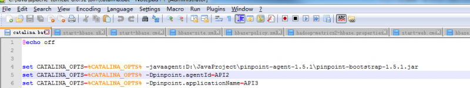
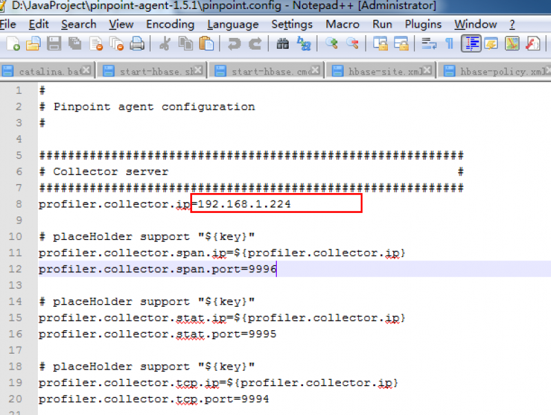
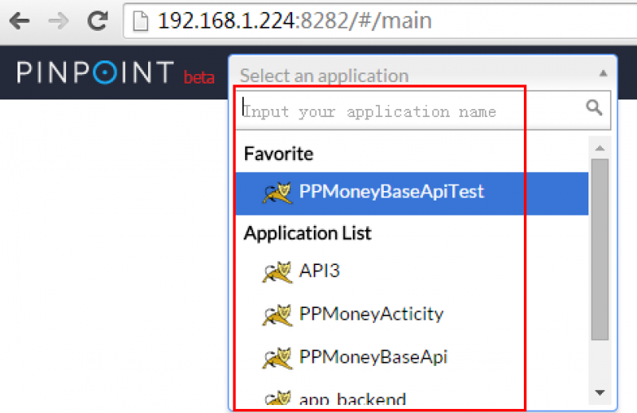

运行agent并结合被监控系统接入pinpoin
======

1. **运行环境**
	1. JDK 6+
	1. Tomcate 6+

1. **下载安装**
	1. [下载](https://github.com/naver/pinpoint/releases)pinpoint-agent-1.5.1.tar.gz

	1. 修改tomcate/bin目录下的catalina.bat添加以下参数
	

    1. 修改pinpoin-agent目录下的pinpoint.config profiler.collector.ip=192.168.1.224这个IP地址需要与你想要接入的collector地址一致
    

    1. 将被监控系统的war文件放入tomcate/webapps中

    1. 启动tomcate，就可以看到你所指定的App（appicationName）会出现在appList中
    

1. **Linux中运行agent结合被监控系统接入**
	```java
        Linux环境与Windows环境基本一致只是修改catalina.bat中参数的命令不一样：
        # vim tomcat7-app/bin/catalina.sh CATALINA_OPTS=“$CATALINA_OPTS -javaagent:/data/pinpoint/pinpoint-agent-1.5.1/pinpoint-bootstrap-1.5.1.jar”

        CATALINA_OPTS=“$CATALINA_OPTS -Dpinpoint.agentId=PPMoneyActicity”

        CATALINA_OPTS=“$CATALINA_OPTS -Dpinpoint.applicationName=PPMoneyActicity”
	```