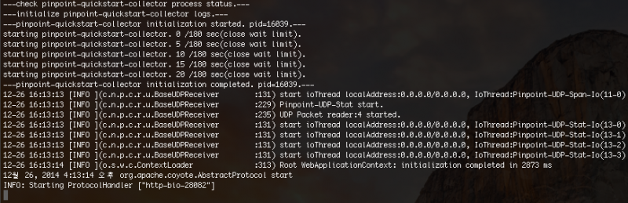
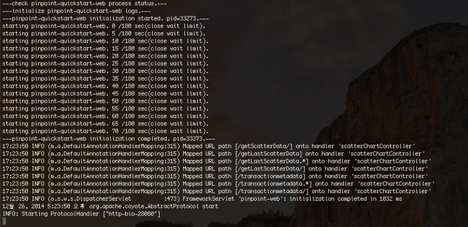
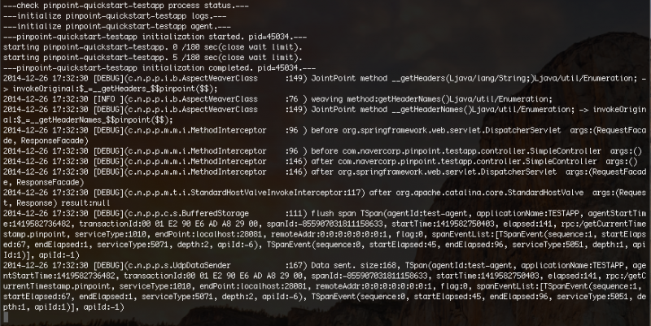

Window下安装
======

1. **安装环境**
	1. JDK 6，7，8安装
	1. Maven 3.2.x+ 安装
	1. 环境变量设置：JAVA_6_HOME=JDK6目录,JAVA_7_HOME=JDK7目录，JAVA_8_HOME=JDK8目录

1. **下载**
	1. 下载PINPOINT，[点这里](https://github.com/naver/pinpoint/tags)，这里选择的是1.5.1版本pinpoint-1.5.1.zip
	1. 下载HBASE，[点这里](http://apache.mirror.cdnetworks.com/hbase/)，跟pinpoint对应的版本是hbase-1.0.x版本hbase-1.0.3-bin.tar.gz

1. **安装Pinpoint和Hbase**
	1. 将pinpoint-1.5.1.zip压缩包解压(如果解压的时候报错了一般会情况下是jruby-complete-1.6.8.jar这个jar包有数据丢失可以从[这里](http://maven.outofmemory.cn/org.jruby/jruby-complete/1.6.8/)下载并覆盖在lib目录)
	1. 在pinpoint目录下执行mvn install -Dmaven.test.skip=true
	1. 将hbase-1.0.3-bin.tar.gz压缩包解压
	1. 在pinpoint-1.5.1/quickstart目录下创建hbase
	1. 将hbase-1.0.3文件复制到pinpoint-1.5.1/quickstart/hbase目录底下
	1. 将hbase-1.0.3重命名为hbase

1. **启动**
	1. 运行pinpoint-1.5.1/quickstart/bin目录底下的start-hbase.cmd（如果启动不成功尝试运行pinpoint-1.5.1/quickstart/hbase/bin/start-hbase.cmd）
	1. 运行pinpoint-1.5.1/quickstart/bin目录底下的init-hbase.cmd（如果已经运行过，则运行reset-hbase.cmd）
	1. 运行start-collector.cmd
	1. 运行start-web.cmd
	1. start-testapp.cmd

    **Collector**
    

    **Web Ui**
    

    **Test App**
    

1. **访问地址**
    1. Web UI - http://localhost:28080
    1. TestApp - http://localhost:28081
