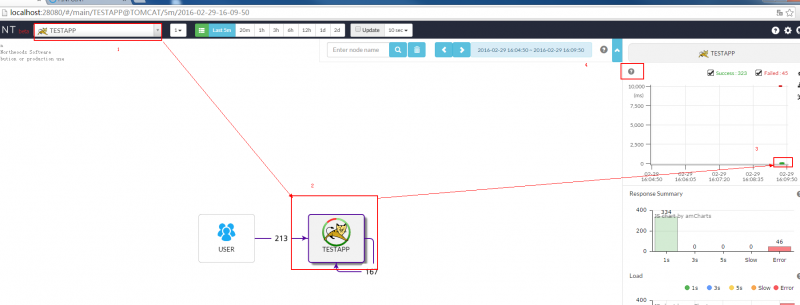
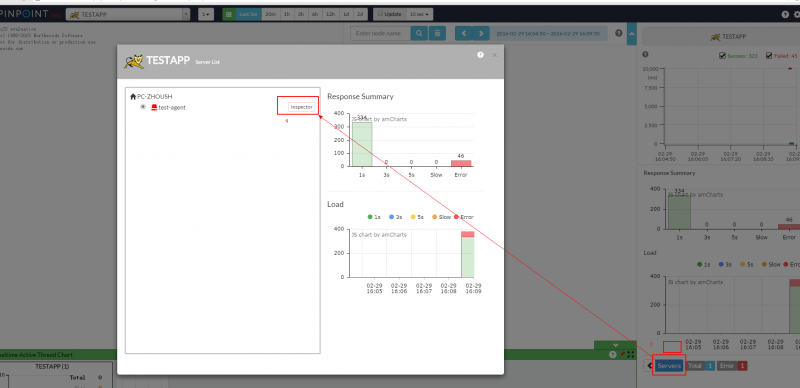

Web页面的使用简介
======

1. 如何进入调用栈
    1. 选择一个应用；
    1. 选择一台服务器；
    1. 用鼠标框选一个你想要查看的请求（若不清楚查看4）
   	

1. 如何查看CPU使用率、内存/垃圾收集，TPS和JVM参数。
    1. 选择一个应用
    1. 选择一台服务器
    1. 点击Servers
    1. 点击Inspector
    